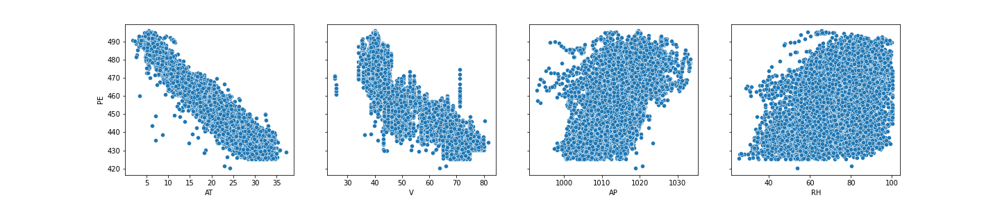
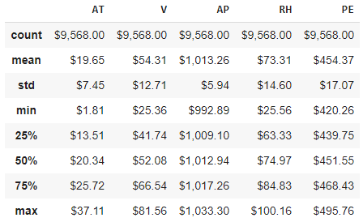
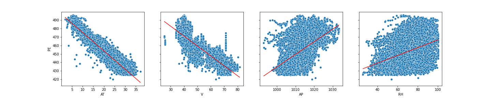
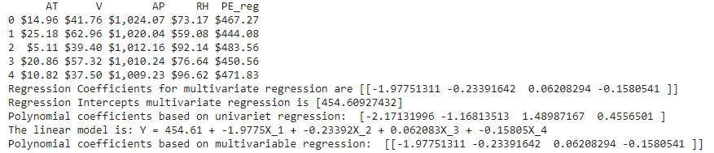
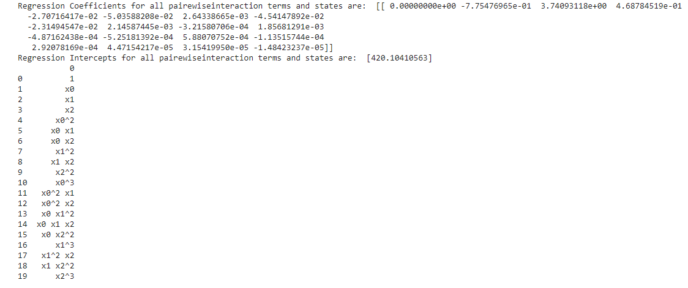
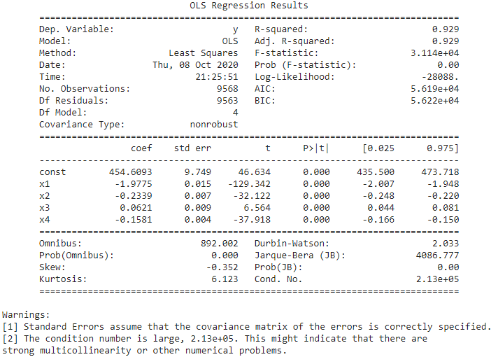
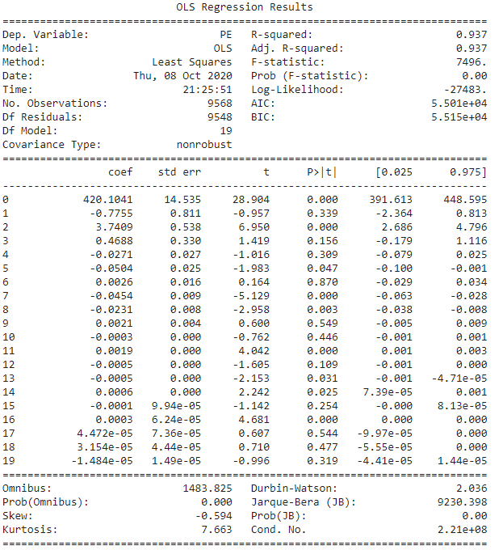
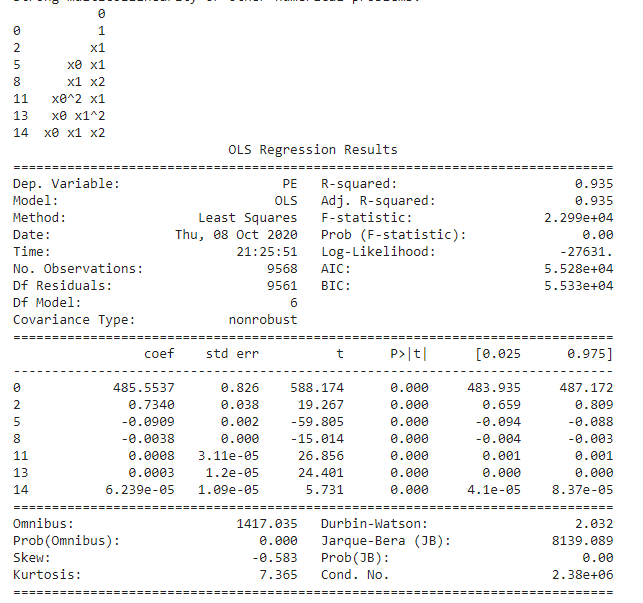
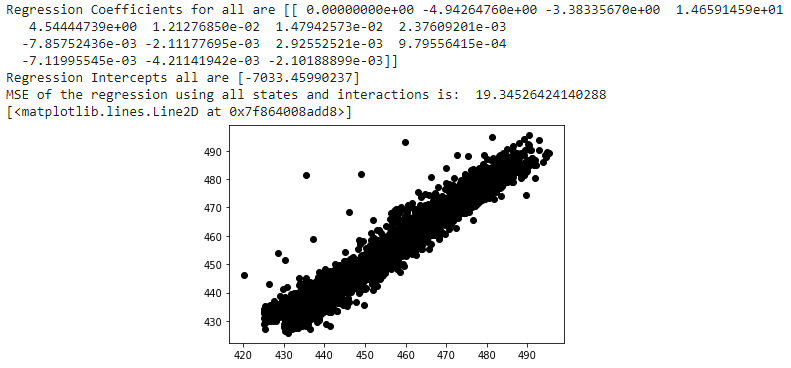
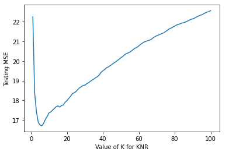

# Project 2: Power Plant - Multivariate Regression

*Combined Cycle Power Plant Data Set*

Coding was done in Google Colab and results are presented here.

The dataset contains data points collected from a Combined Cycle Power Plant over  6 years (2006-2011), when the power plant was set to work with full load. Features consist of hourly average ambient variables Temperature (T), Ambient Pressure (AP), Relative Humidity (RH) and Exhaust Vacuum (V) to predict the net hourly electrical energy output (PE) of the plant. 

**1. Download the Combined Cycle Power Plant data1 from:**
https://archive.ics.uci.edu/ml/datasets/Combined+Cycle+Power+Plant 

**2. Data Exploration**

**3. Initial Linear Regression on all data - Without removing insignificant features**

**4. Multi-Variat Regression after removing insignificant terms**

**5.  Full linear regression model with all pairwise interaction terms and states whether any interaction terms are statistically signifcant or not**

**6. Test the significance of the states statistically**

**7. Eliminate insignificant terms and check the statistics of the remianing - P-Value, R-squared and Adj. R-squared:**

**8. Train the regression model on a randomly selected 70% subset of the data with all predictors. Test both models on the remaining points and report your train and test MSEs.**

**9.  k-nearest neighbor regression using both normalized and raw features. Found the value of k: 1,2, ...,100 that gives the best fit. Plotted the train and test errors in terms of 1/k.**

